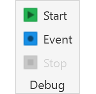
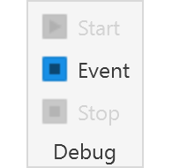
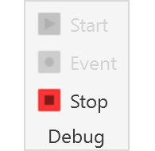
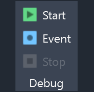
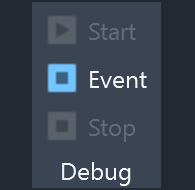
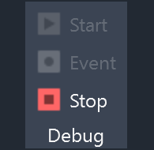

# RevitAddin.VisualStudioDebug

The `RevitAddin.VisualStudioDebug` plugin allow to enable debug in the current section of Revit and Visual Studio.

This project was generated by the [ricaun.AppLoader](https://ricaun.com/AppLoader/) Revit plugin.

## Usage

In the `Add-Ins` tab the panel `Debug` is created with three buttons `Start`, `Event`, and `Stop`.

* `Start`: Start Debugging using Visual Studio process.
* `Event`: Start Debugging using Visual Studio process when an assembly is loaded in the `AppDomain`.
* `Stop`: Stop Debugging using Visual Studio process.

## Installation

* Download and install [RevitAddin.VisualStudioDebug.exe](../../releases/latest/download/RevitAddin.VisualStudioDebug.zip)

## License

This project is [licensed](LICENSE) under the [MIT License](https://en.wikipedia.org/wiki/MIT_License).

---

Do you like this project? Please [star this project on GitHub](../../stargazers)!